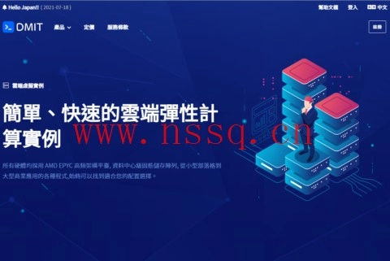

# DMIT 洛杉矶 LAX POCKET 套餐春节6折：年付仅需$99，三网CN2 GIA直连

---

如果你正在找一台稳定、速度快、对国内访问友好的美国VPS，DMIT的洛杉矶机房可能是个不错的选择。特别是现在春节促销期间，LAX POCKET套餐直接打6折，年付从原价$159降到$99，而且这个折扣是永久的——续费也是这个价。

这篇文章会把DMIT这次促销的具体配置、价格、线路特点都讲清楚，帮你判断是否适合自己的需求。

---

## DMIT是谁？为什么值得关注

DMIT是2017年成立的美国服务器商，主要卖洛杉矶机房的VPS产品。它家最大的特点是**线路质量稳**——全系洛杉矶套餐都走三网CN2 GIA线路，国内访问延迟低、丢包少。而且在线率很高,不是那种三天两头出问题的商家。

付款方式支持支付宝、PayPal和信用卡，国内用户买起来没障碍。

他们家主要有两种带宽选择：
- **CN2 GIA带宽线路**：对国内优化最好的选择，延迟低速度快
- **BGP带宽线路**：大带宽不限流量，适合跑流量的场景

这次促销主要针对CN2 GIA线路的套餐。

## 春节促销详情

### LAX POCKET套餐（最划算）

**配置：**
- 1核 EPYC CPU
- 2GB 内存
- 40GB SSD 硬盘
- 1.5TB 月流量
- 4Gbps 端口带宽

**价格：** 年付 $99（原价 $159.98）

这个配置适合建站、轻量代理、测试环境等场景。1.5TB流量对个人使用来说基本够用，4Gbps带宽跑满速度也很快。关键是**永久6折**，以后续费也是这个价。

👉 [如果你正在找一台稳定的CN2 GIA美国VPS，现在入手DMIT正合适](https://www.dmit.io/aff.php?aff=13832)，春节促销力度确实不小。

### LAX MINI套餐（性能更强）

**配置：**
- 2核 EPYC CPU  
- 2GB 内存
- 80GB SSD 硬盘
- 5TB 月流量
- 4Gbps 端口带宽

**价格选项：**
- 年付 $399（原价 $629.99）——可循环使用优惠码3次
- 半年付 $279（原价 $349.99）

这个套餐适合流量需求更大、需要多核CPU的场景，比如跑一些计算任务或者多个服务。5TB流量基本不用担心超标。

### 额外福利

LAX MINI 和 LAX STARTER 套餐的老用户，会在30天内**自动升级到2GB内存**（需要重启VPS才能生效，建议2月15日后操作）。

## 线路情况实测

DMIT洛杉矶机房的线路配置是这样的：

**去程：**
- 电信：走 GIA (AS4809)
- 联通：直连 AS4837
- 移动：经香港移动 (AS58453)

**回程：** 三网都是 GIA (AS4809)

简单说就是：电信用户体验最好，联通其次，移动也不错。国内各地访问延迟通常在150-180ms之间，晚高峰也比较稳定，不会出现严重卡顿。

测试IP：154.17.2.14

## 适合什么场景

根据配置和线路特点，DMIT比较适合：

1. **建站需求**：WordPress、小型应用等，CN2 GIA线路国内访问快
2. **轻量代理**：个人使用，1.5TB流量够用，速度稳定
3. **测试环境**：开发测试用，配置够用价格不贵
4. **需要稳定性**：不想三天两头处理服务器问题的用户

不太适合的场景：
- 超大流量需求（考虑BGP不限流量方案）
- 需要超高配置的生产环境
- 对延迟要求极高的游戏服务器（物理距离决定了基础延迟）

## 其他需要知道的

**带宽和流量：** 4Gbps端口带宽是指最高速度，实际使用受流量包限制。1.5TB用完后会限速或停止（具体看套餐条款）。

**续费价格：** LAX POCKET的6折是永久的，这点比较良心。LAX MINI的优惠码可以循环3次，之后恢复原价。

**退款政策：** 建议购买前确认退款条款，一般VPS商家首次购买会有退款期。

**技术支持：** DMIT的工单系统是英文的，回复速度一般，不是那种秒回的类型。

## 怎么买

1. 访问DMIT官网
2. 选择对应套餐
3. 结账时使用对应优惠码（LAX POCKET已自动应用6折）
4. 选择支付宝或其他支付方式完成付款
5. 收到邮件后登录面板开通服务器

整个流程5-10分钟搞定，开通后立即可用。

---

# 总结

DMIT的春节促销确实有点意思，特别是LAX POCKET套餐年付$99这个价格，对于想要一台稳定CN2 GIA美国VPS的人来说性价比不错。线路质量摆在那里，三网回程都是GIA，国内访问体验有保证。

如果你正好有建站、代理或者测试需求，现在入手比较合适——永久6折不是天天有的。不过记得根据自己的实际流量需求选套餐，别买大了浪费，也别买小了不够用。👉 [DMIT洛杉矶机房的CN2 GIA线路确实适合对国内访问速度有要求的场景](https://www.dmit.io/aff.php?aff=13832)，春节促销期间值得考虑。
